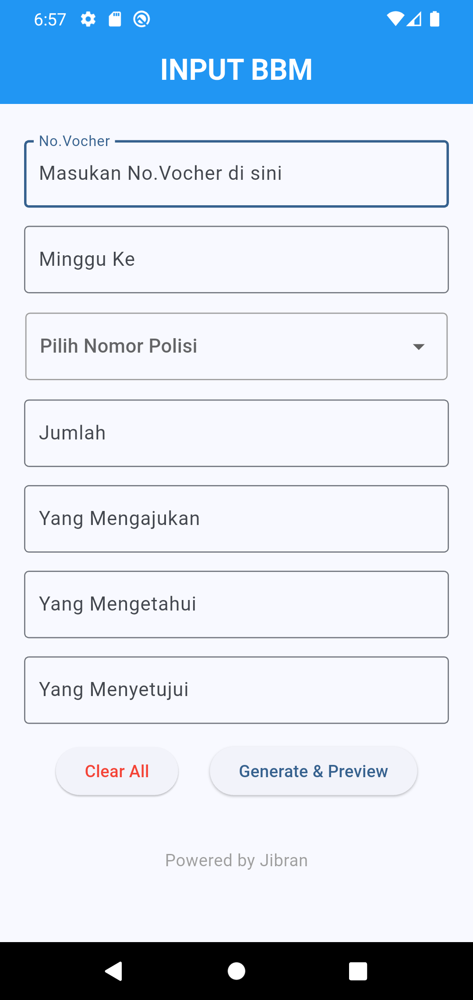
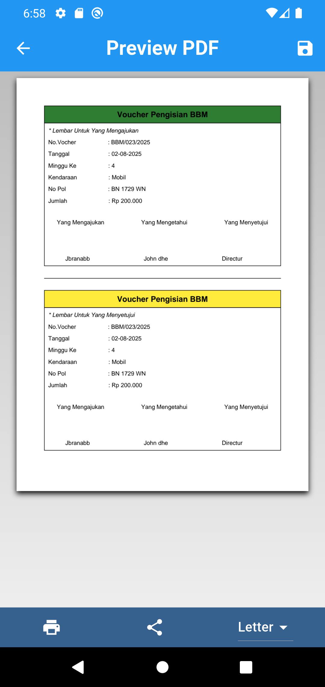
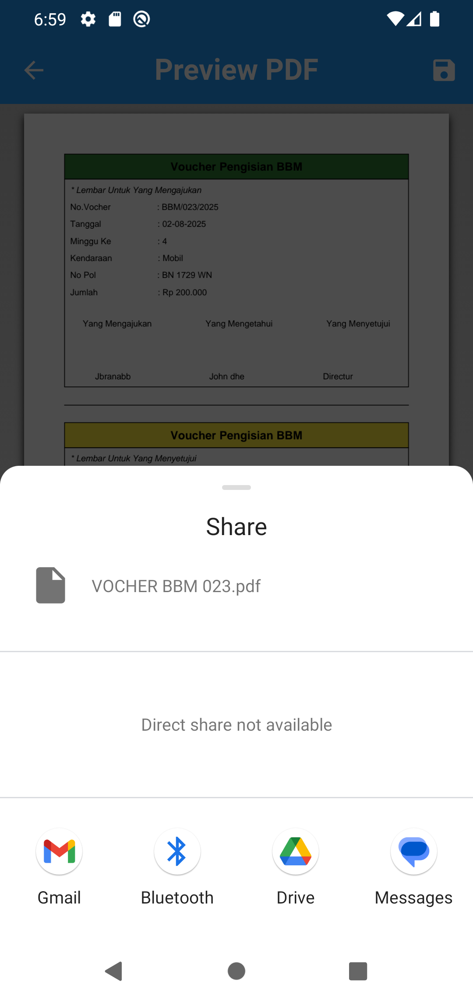
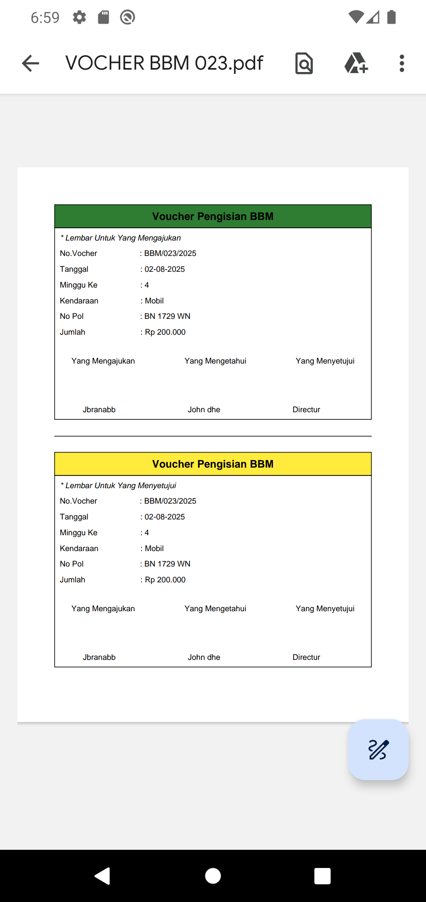

# ⛽ Vocher PDF Genrator

**VocherbbmApp** is a cross-platform mobile application built with Flutter that allows users to generate PDF vouchers for fuel (BBM) filling operations. Designed for operational efficiency, this app streamlines the process of issuing standardized fuel vouchers using a form-based interface.

---

## 🚀 Purpose and Scope

This document provides a comprehensive overview of the **vocherbbmt Flutter application**, a cross-platform voucher generation system specifically designed for BBM (Bahan Bakar Minyak/fuel) filling operations.

The application enables users to:
- Input voucher details through a dynamic form
- Automatically generate standardized PDF vouchers
- Access platform-native capabilities via Flutter plugins

This overview covers:
- High-level architecture
- Core application flow
- Key technologies used

> 📌 For platform-specific logic, see _Platform Implementations_.  
> 📌 For CI/CD and build steps, see _Build System_.

---

## 📱 Core Features

- 📝 **Voucher Form Input**: Fill in fields like vehicle number, fuel type, date, quantity, etc.
- 📄 **PDF Generation**: Automatically create printable, standardized fuel vouchers
- 📁 **File Storage**: Save or share the generated PDF through native sharing options
- 🧑‍💻 **Cross-Platform**: Compatible with both Android and iOS via Flutter
- 🔐 **Lightweight & Offline-first**: Works without active internet connection

---

## 🧩 Architecture Overview

vocherbbmt follows a scalable and modular structure:

- **Flutter Framework**: UI and logic built using Flutter SDK
- **Form Management**: Using `TextEditingController` and form validation
- **PDF Creation**: Leveraging the `pdf` and `printing` packages
- **Local File Access**: Handled via `path_provider` and `share_plus`

---

## ⚙️ Tech Stack

| Technology         | Usage                                         |
|--------------------|-----------------------------------------------|
| Flutter            | Cross-platform development framework          |
| Dart               | Programming language                          |
| pdf                | PDF file creation                             |
| printing           | File rendering and printing/sharing           |
| path_provider      | Locating file paths on device                 |
| share_plus         | Sharing generated files                       |

---

## 🔁 Application Flow

1. User opens the app and sees the voucher form
2. User fills out all required fields (e.g., vehicle info, fuel type, amount)
3. User taps the "Generate" button
4. App processes the data and generates a PDF voucher
5. PDF can be previewed, saved, or shared

---


<h3>Input Page & Preview Page </h3> <p align="center">  &nbsp;  </p> 

---


<h3>Share Page & Save to Device </h3> <p align="center">  &nbsp;  </p> 

---


## 🛠️ Build System

To build and run the app:

```bash
# Clone the repository
git clone https://github.com/your-username/vocherbbmt.git

# Navigate into the project directory
cd vocherbbmt

# Get Flutter dependencies
flutter pub get

# Run the app on device or emulator
flutter run

```

## 📬 Contact Developer
>🛠️ If you experience any issues, feel free to contact me at : 📩 zibranaby069@gmail.com